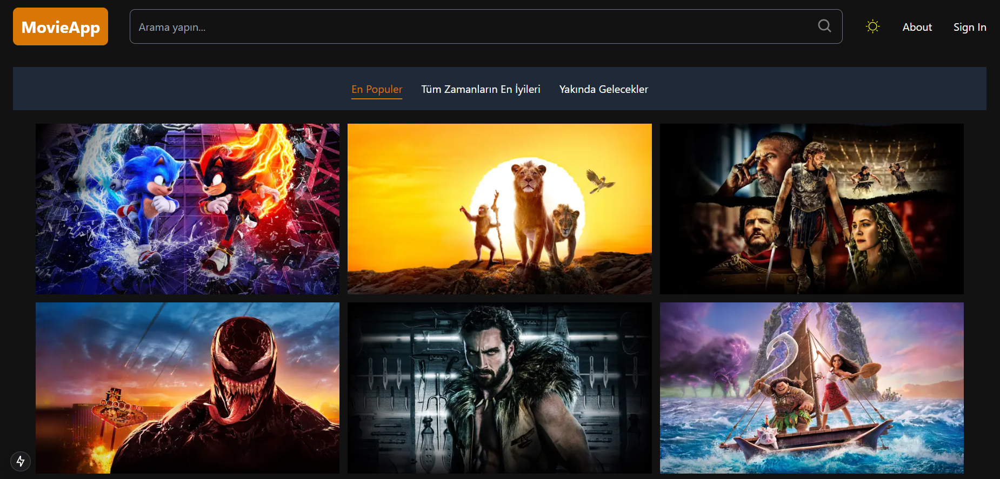
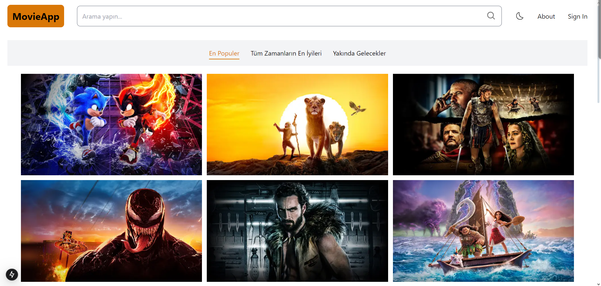
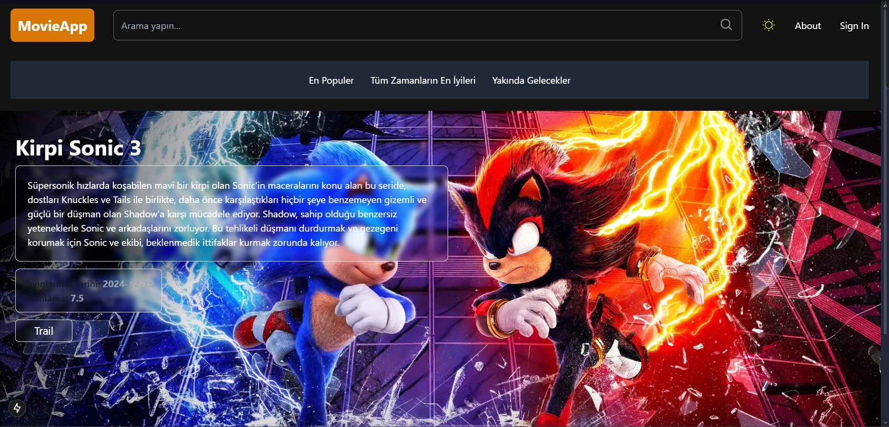

---

# Film Listeleme Sitesi

Bu proje, kullanıcıların popüler filmleri, tüm zamanların en iyi filmlerini ve son çıkan filmleri listeleyebileceği bir web uygulamasıdır. **Next.js** ile geliştirilmiş olup, modern bir tasarım ve kullanıcı dostu bir arayüz sunar. Film verileri **TMDB API** üzerinden alınmaktadır.  

## Özellikler

- **Film Listeleme:**
  - **Popüler Filmler:** Kullanıcı en popüler filmleri listeleyebilir.  
  - **Tüm Zamanların En İyileri:** Tüm zamanların en beğenilen filmlerini görüntüleyebilir.  
  - **Son Çıkanlar:** En yeni filmleri listeleyebilir.  
- **Arama Özelliği:**
  - Arama çubuğuna ilgili başlıklar yazılarak spesifik filmler bulunabilir.  
- **Film Detay Sayfası:**
  - Her film kartına tıklayarak detay sayfasına erişilebilir.
  - Detay sayfasında film açıklaması, türü, yayın tarihi ve daha fazlası yer alır.  
- **Tema Desteği:**
  - **Next-Theme** kullanılarak açık ve koyu mod desteği sağlanmıştır.  
- **Responsive Tasarım:**
  - **Tailwind CSS** ile her cihaz için optimize edilmiş kullanıcı arayüzü.

## Kullanılan Teknolojiler

### Framework ve Araçlar:
- **Next.js**  
- **TMDB API**

### Kütüphaneler:
- **Tailwind CSS**  
- **Next-Theme**

## Kurulum ve Çalıştırma

1. Proje dizinine gidin:
   ```bash
   cd nextjs-film-website-project
   ```
2. Gerekli bağımlılıkları yükleyin:
   ```bash
   npm install
   ```
3. `.env.local` dosyasını oluşturun ve TMDB API anahtarınızı ekleyin:
   ```env
   SECRET_API_KEY=your_secret_key
   NEXT_PUBLIC_TMDB_BASE_URL=https://api.themoviedb.org
   ```
4. Uygulamayı geliştirme modunda başlatın:
   ```bash
   npm run dev
   ```
5. Tarayıcınızda `http://localhost:3000` adresine gidin.

## Ekran Görüntüleri

- **Ana Sayfa:** Popüler filmlerin listelendiği bir alan.  
- **Film Detay Sayfası:** Seçilen filme ait bilgilerin yer aldığı detaylı bir sayfa.  
- **Tema Desteği:** Açık ve koyu mod örnekleri.

## API Kullanımı

Proje TMDB API üzerinden veri alır. Daha fazla bilgi için [TMDB API belgelerine](https://developer.themoviedb.org/docs) göz atabilirsiniz.

## Katkıda Bulunma

1. Bu projeyi forklayın.  
2. Yeni bir dal oluşturun:  
   ```bash
   git checkout -b yeni-ozellik
   ```
3. Değişikliklerinizi commit edin:  
   ```bash
   git commit -m "Yeni bir özellik eklendi"
   ```
4. Dalınızı push edin:  
   ```bash
   git push origin yeni-ozellik
   ```
5. Pull Request oluşturun.


## Ekran Görselleri





## Lisans

Bu proje MIT Lisansı ile lisanslanmıştır. Daha fazla bilgi için `LICENSE` dosyasına bakabilirsiniz.

---
